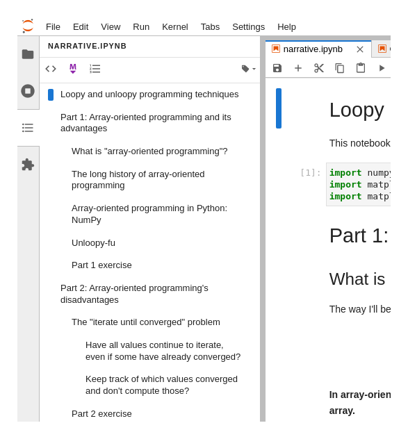

# Loopy and unloopy programming techniques

This repository contains everything you need to follow the "Loopy and unloopy programming techniques" tutorial, presented at the [SciPy conference](https://www.scipy2022.scipy.org/) on [July 11, 2022 at 1:30pm‒5:30pm CDT](https://www.scipy2022.scipy.org/tutorials-schedule).

## How to participate

You don't need to install anything on your computer to participate; I encourage everyone to join on Binder.

  

**Binder tips:**

If your notebook becomes unresponsive, reconnect to the kernel or restart the kernel from the "Kernel" menu.

While working on exercises, keep a copy of your work-in-progress in a text editor, so that you don't lose them if the web page reloads. "Run → Run All Above Selected Cell" and "Kernel → Restart Kernel and Run up to Selected Cell" will rerun all of the code to get your Python session back to the state it was in before a page reload or kernel restart.

In JupyterLab, the left-bar lets you navigate through files, shut down unnecessary kernels (closing a notebook tab does not shut down its Python kernel), and navigate the table of contents.

<table width="100%"><tr>
  <td></td>
  <td></td>
  <td></td>
</tr></table>

**Google Colab:**

The "intermezzo" demo will be run on [Google Colab](https://research.google.com/colaboratory/) (because it requires a GPU). You can join that as well if you have a Colab account, but you don't have to—none of the exercises require it.

## If you _want_ to install and run on your computer

We use the libraries and versions listed in [requirements.txt](requirements.txt). You also need to install JupyterLab. You don't have to install the libraries with pip (you can use conda, for instance), and you don't need to use the exact versions that this tutorial has been pinned to, but you should probably use _at least_ those versions. Note that `awkward>=1.9.0rc5` is a minimum requirement and a pre-release.

We won't spend any time in the tutorial session on installing libraries. If an installation on your computer doesn't work, switch to Binder by pressing the button above.

## Browsing the material online

If you want to see the notebooks online but don't want to execute them in Binder, the starting point is [narrative.ipynb](narrative.ipynb), which continues into notebooks in the [exercises](exercises) directory. It does not contain a direct link to the [solutions](solutions), but you can navigate there manually.

The default notebooks are unevaluated. To see static outputs from a previous run, look at the "-EVALUATED" version of each notebook.

## Rough timeline of the tutorial

The tutorial is designed around three major exercises with some introductory material for each, and it is designed to fit into 4 hours, with breaks. Here is a rough timeline of how we may go through it, though I'll adjust based on feedback from the participants.

   * **01:30pm** Start the [narrative](narrative.ipynb) ([evaluated](narrative-EVALUATED.ipynb))
   * **01:30pm (20 min)** Introduction to exercise 1
   * **01:50pm (20 min)** Participants work on [exercise 1](exercises/exercise-1.ipynb) ([evaluated](exercises/exercise-1-EVALUATED.ipynb))
   * **02:05pm (15 min)** Break
   * **02:25pm (20 min)** We go through the [solutions to exercise 1](solutions/solution-1.ipynb) ([evaluated](solutions/solution-1-EVALUATED.ipynb))
   * **02:45pm (20 min)** Introduction to exercise 2
   * **03:05pm (20 min)** Participants work on [exercise 2](exercises/exercise-2.ipynb) ([evaluated](exercises/exercise-2-EVALUATED.ipynb))
   * **03:20pm (15 min)** Break
   * **03:40pm (20 min)** We go through the [solutions to exercise 2](solutions/solution-2.ipynb) ([evaluated](solutions/solution-2-EVALUATED.ipynb))
   * **03:55pm (15 min)** [Intermezzo: demo on Google Colab](https://drive.google.com/file/d/1J0l5e0NZm5kEm5BEUDG4neN5EN0VVCnt/view?usp=sharing)
   * **04:15pm (20 min)** Introduction to exercise 3
   * **04:35pm (20 min)** Participants work on [exercise 3](exercises/exercise-3.ipynb) ([evaluated](exercises/exercise-3-EVALUATED.ipynb))
   * **04:50pm (15 min)** Break
   * **05:10pm (20 min)** We go through the [solutions to exercise 3](solutions/solution-3.ipynb) ([evaluated](solutions/solution-3-EVALUATED.ipynb))
   * **05:30pm** The end!
